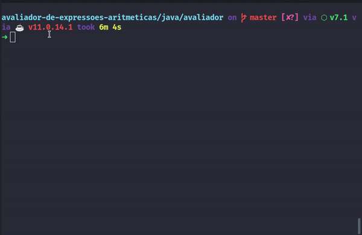

# Avaliador de expressões aritmeticas

  O programa lê expressões aritméticas da entrada padrão e realiza o calculo do resultado descrevendo passo a passo a resolução.


## Como executar

  ### Java
    
  Entre na pasta do projeto e execute o seguinte comando no terminal:

  ```bash
  ./gradlew run --console=plain
  ```

  Para executar o testes execute:

  ```bash
  ./gradlew test
  ```
  
  ### Rust
    
  Entre na pasta do projeto e execute o seguinte comando no terminal:

  ```bash
  cargo run
  ```

  Para executar o testes execute:

  ```bash
  cargo test
  ```
  
  Para sair do programa basta digitar ``exit`` no input do programa.
    <p align='center'>
          
   </p>
